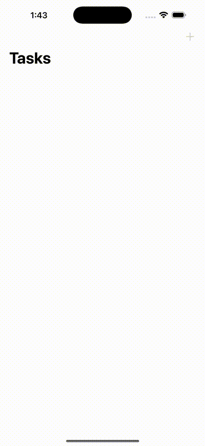

# ✅ TodoList (SwiftUI Practice)

This project is a **personal practice exercise** with SwiftUI and iOS.  
The goal is to experiment with views, state management, bindings, and navigation in a task list context — it is **not intended as a production-ready app**.

---

## 📸 Demo

  

*(GIF generated from an iOS simulator recording)*  

---

## 🧩 Structure

Recommended folder layout:

